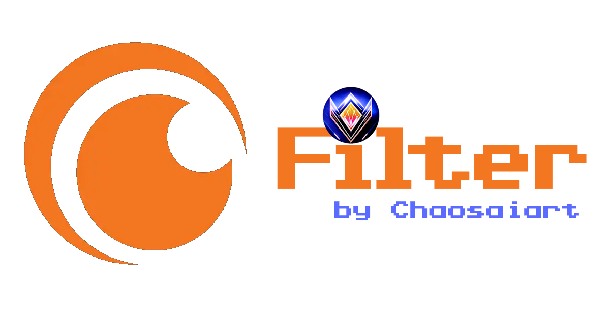

 

 

 
  
  
  
  

 
 

# Regionen Status:
    

 

| Region | Last Update  |
|:------:|:------------:|
|   US   | 25.10.2024   |
|   DE   | 25.10.2024   |

 

    
    

# Features 

Filter by: 

- Audio (Dubbing)  
- Subtitles  
- Film Length  
- Age Rating  
- Crunchyroll Tags  
- chaosaiart Tags ( Iseak & Sliece of Life )

 
 

Search by:  

- Name  

 
 

Sort by: 

- Alphabet  
- Age Rating
- Rating  
- Release Date  
- Anime Awards  

 
 

Additional Features: 

- Random Anime with current filters  
- AI Dubs  
- Region selection

 
 

# Database
The Database of the Crunchyroll assortment is stored as an SQL file repository.

Regions are completely separated in Databasestructure. 
Reason: It is unclear whether the regions share the same data, such as Dubs & Subtitles....

Last Update : 23.10.2024

 
